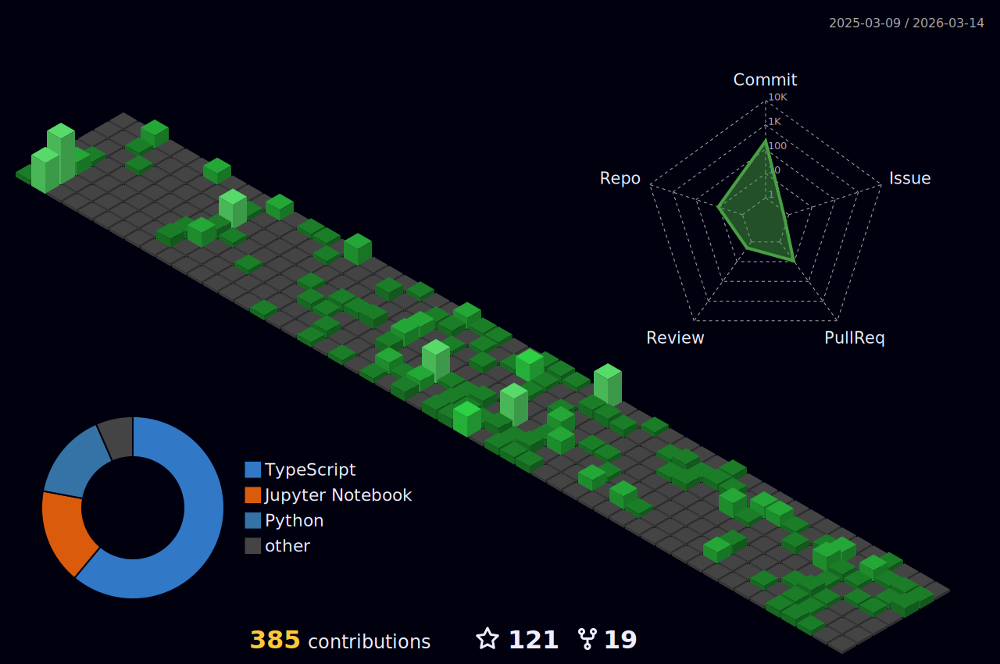

<h1> Hey, I’m Mihir! </h1>

 

Hi, I’m Purv Kabaria, an aspiring software developer exploring Machine Learning, GenAI and Agentic AI. I have participated in multiple hackathons all around the nation, and even organized a few. I have a strong background with Full Stack Development, DevOps and AI/ML. I enjoy collaborating with like-minded individual to create opportunities that push the boundaries of AI and human machine collaboration. Feel free to reach out via your favorite platform :)

<ul>
<li> 🌱 I’m currently pursuing B.Tech in Computer Science & Engineering at NIT Surat </li>
<li> 💼 Wanna colab on Projects? do reach, <a href="mailto:purvkabaria@gmail.com">email</a></li>
<li> 💬 Ask me about anything, I am happy to help </li>
<li> ⚡ Fun fact : The more you GRIND, the more you GET💫</li>
</ul>

  

<h2>Mihir's Contribution Graph<h2>

 

<h2>GitHub Trophies<h2>

 
  
  
  

</a>

## 3D Contribution Calendar 📅
 

<h1>Github Contribution✨<h1>

